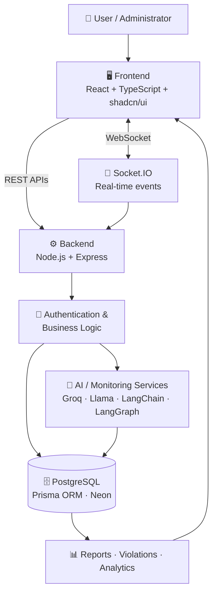

<div align="center">


### A unified platform for secure online assessments, real-time monitoring, AI-assisted integrity analysis and security operations.

<br/>

[](https://assessment-integrity.vercel.app/)
[](#-project-status)


[Overview](#-overview) •
[Features](#-key-features) •
[Architecture](#-system-architecture) •
[Tech Stack](#-technology-stack) •
[Getting Started](#-getting-started) •
[Security](#-security-operations) •
[Roadmap](#-roadmap) •
[Team](#-project-team)

</div>

---

## 📖 Overview

Online assessments face real challenges: **plagiarism, impersonation, suspicious behavior, unauthorized assistance and cybersecurity threats.**

**IntegrityOS** brings students, faculty, support teams and administrators into one platform, with dedicated portals, live session monitoring, AI-assisted analysis and a security operations console.

| 🎯 Focus Area | 📝 What It Delivers |
|---|---|
| **Secure assessments** | Centralized assessment management |
| **Live monitoring** | Real-time session tracking and status |
| **AI analysis** | Plagiarism, behavior and violation analysis |
| **Threat detection** | Security event logging and incident tracking |
| **Access control** | Role-based portals for every user type |
| **Insight** | Reports, analytics and risk scoring |

---

## ✨ Key Features

<table>
<tr>
<td width="50%" valign="top">

### 🎥 Live Assessment Monitoring
- Live session monitoring
- Candidate activity tracking
- Risk score management
- Violation logging
- Suspicious behavior detection
- Session status tracking

</td>
<td width="50%" valign="top">

### 🤖 AI-Assisted Integrity Analysis
- Plagiarism analysis
- Suspicious behavior analysis
- Assessment integrity checks
- Violation classification
- Security event analysis
- Automated risk evaluation

</td>
</tr>
<tr>
<td width="50%" valign="top">

### 🔐 WAF Security Agent
- Dynamic agent monitoring
- Security event simulation
- Risk score management
- Incident logging
- Threat intelligence feed
- Automated incident analysis

</td>
<td width="50%" valign="top">

### 👁️ Behavior Analysis
- Records behavioral integrity indicators
- Presents events to authorized reviewers
- Centralized review workflow for suspicious activity

</td>
</tr>
</table>

> [!IMPORTANT]
> AI-generated results **support human reviewers** and are not automatic final judgments. See [Responsible Use](#️-responsible-use).

### 👥 Multi-Role Portal System

| Portal | Audience | Purpose |
|:---:|---|---|
| 🎓 **Student** | Candidates | Access assessment functionality |
| 🧑‍🏫 **Faculty** | Instructors | Manage and review assessment activity |
| 🛠️ **Support** | Support staff | Assist with operational and technical issues |
| 🛡️ **Admin** | Administrators | Monitoring, security controls, reports and system management |

### 📊 Admin Dashboard

```text
Overview  ▸  Assessments  ▸  Live Monitoring  ▸  AI Violations  ▸  Students
Reports   ▸  Analytics    ▸  Security Operations  ▸  Settings
```

---

## 🖼️ Screenshots

> Add your screenshots to a `docs/screenshots/` folder and update the paths below.

| Admin Dashboard | Live Monitoring |
|:---:|:---:|
|  |  |

| AI Violations | WAF Security Operations |
|:---:|:---:|
|  |  |

---

## 🎯 Project Objectives

1. 🏗️ Build and deploy a centralized platform for secure assessment management and monitoring.
2. 🤖 Integrate AI-based plagiarism detection, behavior analysis and suspicious activity monitoring.
3. 🛰️ Implement real-time security monitoring and automated threat detection to improve assessment integrity.

---

## 🏗️ System Architecture



**Request lifecycle**

1. A user opens the appropriate IntegrityOS portal.
2. The frontend sends requests to the backend APIs.
3. The backend validates and processes the request.
4. Assessment and user data is read from or written to the database.
5. AI or monitoring services process relevant events when required.
6. Results and violations are recorded.
7. Authorized users review everything through the dashboard.

---

## 🛠️ Technology Stack

| Layer | Technologies |
|---|---|
| **Frontend** | React, TypeScript, shadcn/ui, responsive component-based UI |
| **Backend** | Node.js, Express.js, REST APIs, authentication & authorization |
| **Database** | PostgreSQL, Prisma ORM, Neon |
| **AI & Processing** | Groq-hosted LLMs, Llama models, LangChain, LangGraph, TensorFlow-based processing |
| **Real-time** | Socket.IO |
| **Design & Tooling** | Git, GitHub, Postman, Figma |
| **Deployment** | Vercel |

---

## 📂 Project Structure

```text
IntegrityOS/
├── assessment-integrity/            # Frontend application
│   ├── src/
│   ├── components/
│   ├── pages/
│   └── public/
│
├── assessment-integrity-backend/    # Backend API
│   ├── src/
│   ├── routes/
│   ├── controllers/
│   ├── services/
│   ├── middleware/
│   └── prisma/
│
└── README.md
```

> The exact structure may vary between project versions.

---

## 🚀 Getting Started

### Prerequisites

- **Node.js** and **npm**
- **Git**
- **PostgreSQL** (local) or a hosted database such as Neon

```bash
node --version
npm --version
git --version
```

### 1️⃣ Clone the repository

```bash
git clone <YOUR_REPOSITORY_URL>
cd IntegrityOS
```

### 2️⃣ Backend setup

```bash
cd assessment-integrity-backend
npm install
```

Create a `.env` file:

```env
DATABASE_URL=your_database_connection_string
JWT_SECRET=your_jwt_secret
GROQ_API_KEY=your_groq_api_key
OPENAI_API_KEY=your_api_key        # optional, only if used
FRONTEND_URL=http://localhost:3000
```

| Variable | Required | Description |
|---|:---:|---|
| `DATABASE_URL` | ✅ | PostgreSQL connection string |
| `JWT_SECRET` | ✅ | Secret used to sign auth tokens |
| `GROQ_API_KEY` | ✅ | Key for Groq-hosted LLMs |
| `OPENAI_API_KEY` | ➖ | Only if your backend uses it |
| `FRONTEND_URL` | ✅ | Frontend origin (used for CORS) |

> [!NOTE]
> Only include variables your backend actually uses, and make sure `FRONTEND_URL` matches the port your frontend runs on.

Set up the database:

```bash
npx prisma generate

# Option A: apply migrations
npx prisma migrate dev

# Option B: sync schema during development
npx prisma db push
```

Start the backend:

```bash
npm run dev
```

### 3️⃣ Frontend setup

Open a second terminal:

```bash
cd assessment-integrity
npm install
npm run dev
```

The app will run on the local URL shown in your terminal.

---

## 🔒 Environment Variable Security

Never commit secrets. Add this to `.gitignore`:

```gitignore
.env
.env.local
.env.production
node_modules/
```

Never expose API keys, database passwords, JWT secrets, credentials or private service tokens.

---

## 🔐 Security Operations

The **WAF Security Operations** console lets administrators inspect assessment-related security events from one place.

| Capability | Description |
|---|---|
| Monitoring controls | Start, stop and check monitoring status |
| Risk score reset | Reset a student's risk score |
| Incident simulation | Simulate security events for testing |
| Event logging | Record every security event |
| Severity classification | Classify threat levels |
| Mitigation tracking | Track incident mitigation status |
| Threat intelligence | AI-driven feed of agent-generated events |

**Example monitored events:** authentication failures · suspicious login behavior · multiple-face detection · suspicious registration patterns · developer-tool bypass attempts.

### 🧠 AI Threat Intelligence Feed

Each event can include:

`Threat target` · `Monitoring agent` · `Security event` · `Severity` · `Mitigation status` · `Timestamp` · `Supporting evidence` · `Risk score`

This lets administrators see not only *what* was flagged, but *why*.

---

## 🧪 Testing Checklist

- [ ] User authentication
- [ ] Role-based portal access
- [ ] Assessment management
- [ ] API communication
- [ ] Database operations
- [ ] Live monitoring
- [ ] AI-assisted analysis
- [ ] Security event logging
- [ ] Risk score updates
- [ ] Deployment functionality

Test each workflow with both valid and invalid inputs before production deployment.

---

## ☁️ Deployment

| Component | Platform | Link |
|---|---|---|
| **Frontend** | Vercel | [assessment-integrity.vercel.app](https://assessment-integrity.vercel.app/) |
| **Backend** | Any Node.js host | Set your production API URL in the frontend config |

---

## 📈 Project Status

**Deployed / Pilot Ready.** Core assessment management, monitoring, security and AI-oriented features are functional. Further testing and production hardening are recommended before large-scale institutional use.

---

## 🗺️ Roadmap

- [x] Multi-role portals (Student, Faculty, Support, Admin)
- [x] Live monitoring and violation logging
- [x] WAF Security Operations console
- [x] AI-assisted analysis workflows
- [x] Vercel deployment
- [ ] Improved plagiarism detection accuracy
- [ ] Advanced AI-generated content analysis
- [ ] Enhanced behavioral monitoring and more accurate risk scoring
- [ ] Advanced assessment analytics and reporting
- [ ] Stronger role-based access control
- [ ] Automated incident response workflows
- [ ] Scalable real-time monitoring
- [ ] AI model evaluation and benchmark datasets
- [ ] Mobile-responsive improvements
- [ ] Production-grade observability

---

## ⚠️ Responsible Use

IntegrityOS is an **assistance** platform. AI-generated risk scores and automated detections are **indicators, not proof** of misconduct. Final academic integrity decisions should always involve human review and supporting evidence.

---

## 🤝 Contributing

Contributions are welcome!

```bash
# 1. Fork the repo, then create a branch
git checkout -b feature/your-feature-name

# 2. Commit your changes
git commit -m "Add new feature"

# 3. Push and open a Pull Request
git push origin feature/your-feature-name
```

---

## 👨‍💻 Project Team
 | Neelampalli Charan Balaji |


---

## 📄 License

Developed as part of an internship project. Add an appropriate open-source license before allowing external reuse or redistribution.

## 📞 Contact

For questions, reach the maintainers through the GitHub repository.

---

<div align="center">

**🛡️ IntegrityOS**
*AI-Powered Assessment Integrity, Monitoring & Security Platform*

⭐ If you found this project useful, consider giving it a star!

</div>
