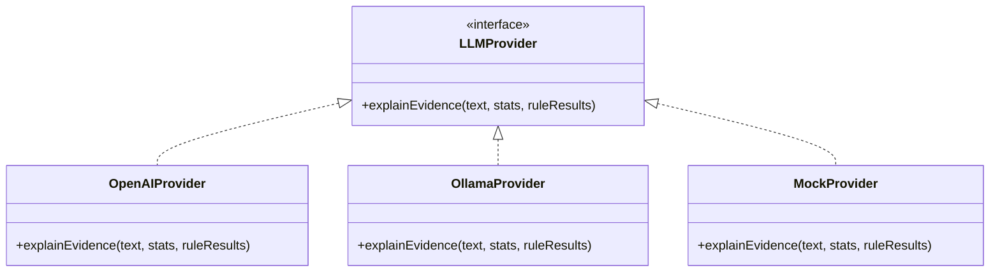

# 🎯 Assessment Integrity: Integrity Analysis Engine

The **Integrity Analysis Engine** is a stateless, multi-layered stylistic evaluation pipeline designed to evaluate student submissions for indicators of AI generation. It combines statistical analysis, grammatical heuristic rules, and Large Language Model (LLM) explanation adapters to establish objective integrity risk metrics.

---

## 📖 Table of Contents
1. [Feature Overview](#1-feature-overview)
2. [Project Structure](#2-project-structure)
3. [Threshold Configuration](#3-threshold-configuration)
4. [Scoring Configuration](#4-scoring-configuration)
5. [Rule Registry](#5-rule-registry)
6. [LLM Provider Architecture](#6-llm-provider-architecture)
7. [API Documentation](#7-api-documentation)
8. [Explainability Model](#8-explainability-model)
9. [Benchmark Framework](#9-benchmark-framework)
10. [Running the Project](#10-running-the-project)
11. [Future Improvements](#11-future-improvements)

---

## 1. Feature Overview

The engine acts as the primary **AI Content Detection** agent in the Assessment Integrity suite. Rather than using raw classification models that output opaque scores, this engine evaluates the input across multiple deterministic tiers and feeds the summarized evidence into an LLM for structured explanation.

### High-Level Processing Workflow
1. **Request Validation**: Parses incoming submission strings against strict character bounds using Zod.
2. **Statistical Metric Extraction**: Evaluates 15 text features (sentence variance, lexical density, read index, word entropy, rare word occurrences).
3. **Stylistic Rule Checking**: Passes the text to the Rule Engine to match 10 specific AI style patterns (connector overuse, spelling standards uniformity, lack of contractions, passive voice concentration, etc.).
4. **Sub-Score Calculations**: Generates numeric scores (0 to 100) for the Statistics and Rule Engine blocks independently.
5. **LLM Evidence Explanation**: Invokes the active LLM provider wrapper to describe the AI-like features found. The LLM is prohibited from deciding guilt or assigning final probability.
6. **AI Detection Score Integration**: Integrates Statistics and Rule Engine scores using configured weights. LLM is excluded from score arithmetic to keep results deterministic.
7. **Structured Evidence Compilation**: Transforms calculated indicators into a list of detailed, category-sorted positive/negative evidence items.
8. **Risk Mapping**: Maps the integrated AI likelihood score to five distinct academic risk tiers and actions.
9. **Overall Integrity Score Calculation**: Normalizes the active AI Detection score against other missing assessment signals (proctoring, similarity, override) to calculate a unified integrity index.

---

## 2. Project Structure

Below is the directory tree of the Integrity Analysis module inside `src/features/integrity-analysis/`:

```text
src/features/integrity-analysis/
├── benchmark/                      # Evaluation & benchmarking framework
│   ├── benchmark-runner.ts         # Asynchronously runs test batches against callback
│   ├── benchmark-types.ts          # Interfaces for samples, reports, and confusion matrices
│   ├── metrics.ts                  # Logic for Precision, Recall, F1, FPR, FNR, Matrix
│   └── sample-dataset.ts           # Standard 17-sample evaluation dataset (Human & AI models)
├── constants/                      # Constants, prompt templates, and registries
│   ├── prompts.ts                  # Prompt constraints regulating LLM explanation output
│   ├── rule-registry.ts            # Core rule metadata (IDs, names, category tags)
│   ├── scoring-config.ts           # Integrated sub-score and overall agent weights
│   └── thresholds.ts               # Numerical trigger margins for stats and rule engines
├── controllers/                    # HTTP request adapters
│   └── integrity-analysis-controller.ts
├── routes/                         # Express routing definitions
│   └── integrity-analysis-routes.ts
├── schemas/                        # Zod payload parsing schemas
│   └── integrity-analysis-schema.ts
├── services/                       # Business logic services
│   ├── llm/                        # Provider implementations
│   │   ├── llm-provider.ts         # Common provider interface
│   │   ├── mock-provider.ts        # Fallback local generator for local dev/testing
│   │   └── openai-provider.ts      # Concrete OpenAI ChatCompletions adapter
│   └── llm-service.ts              # LLM factory and orchestration entry point
├── tests/                          # Vitest unit and integration tests
│   ├── benchmark.test.ts
│   ├── evidence.test.ts
│   ├── integrity-analysis-api.test.ts
│   ├── llm-service.test.ts
│   ├── overall-integrity-score.test.ts
│   ├── risk-mapper.test.ts
│   ├── rules.test.ts
│   ├── scoring.test.ts
│   └── statistics.test.ts
└── utils/                          # Pure functional math helpers
    ├── evidence.ts                 # Formats stats/rules matches to user-friendly explainability items
    ├── overall-integrity-score.ts  # Normalizes and sums proctoring/face/override metrics
    ├── risk-mapper.ts              # Translates score percentages to risk bounds and actions
    ├── rules.ts                    # Formulates the 10 structural heuristics checks
    └── statistics.ts               # Calculates 15 stylistic textual features
```

---

## 3. Threshold Configuration

All deterministic boundaries utilized by statistics and rule engines are consolidated inside [thresholds.ts](file:///d:/ai-detect/assessment-integrity-backend/src/features/integrity-analysis/constants/thresholds.ts).

### Structure
- `STATS_THRESHOLDS`: Governs metrics like vocabulary variety (`typeTokenRatio < 0.50`), sentence length variation (`sentenceLengthStdDev < 5.0`), paragraph variance, character entropy, and rare word frequencies.
- `RULE_THRESHOLDS`: Defines specific criteria for heuristics (e.g. passive density levels, minimum scanning length counts like `minWords: 100`, spelling consistency margins, and transitional phrase counts).

### Safely Tuning Thresholds
- To increase model sensitivity (flagging more submissions as AI):
  - Increase `sentenceLengthStdDev` threshold (e.g., from `5.0` to `6.5`). Since AI sentence lengths are uniform, setting a higher ceiling will capture more uniform patterns.
  - Decrease `typeTokenRatio` threshold (e.g., from `0.5` to `0.45`).
- Before pushing changes to production, **always run the benchmark suite** to measure the impact of your modifications on the False Positive Rate (FPR) and Recall metrics:
  ```powershell
  pnpm test src/features/integrity-analysis/tests/benchmark.test.ts
  ```

---

## 4. Scoring Configuration

Integrated score math is controlled globally from [scoring-config.ts](file:///d:/ai-detect/assessment-integrity-backend/src/features/integrity-analysis/constants/scoring-config.ts).

```ts
export const AI_DETECTION_WEIGHTS = {
  statistics: 0.40, // 40% weight on text metric distributions
  rules: 0.35,      // 35% weight on heuristic pattern matches
  llm: 0.25,        // 25% weight on LLM scores (optional/mockable)
} as const;
```

### Safety Rules for Adjusting Weights
- **Sub-Score Balance**: If the LLM score is absent, `calculateIntegratedScore` normalizes using only active sub-weights (Statistics and Rules), making the engine resilient.
- **Overall Integrity Weights**: Consolidates multiple scoring metrics, including Face Verification, live proctoring, and similarity coefficients. If any metric is absent, weights are dynamically adjusted relative to the remaining signals.
- Ensure that the weights inside `AI_DETECTION_WEIGHTS` sum to `1.00`, and weights inside `OVERALL_INTEGRITY_WEIGHTS` sum to `1.00` to avoid normalization anomalies.

---

## 5. Rule Registry

Rule classifications and descriptions are defined in [rule-registry.ts](file:///d:/ai-detect/assessment-integrity-backend/src/features/integrity-analysis/constants/rule-registry.ts).

### Adding a New Rule
1. Open [rule-registry.ts](file:///d:/ai-detect/assessment-integrity-backend/src/features/integrity-analysis/constants/rule-registry.ts) and add a key-value entry:
   ```ts
   myNewRule: {
     id: "RULE_011",
     name: "My New Rule Name",
     description: "Identifies stylistic anomalies in the text.",
     severity: "low",
     category: "Style",
   }
   ```
2. Implement the rule check function in [rules.ts](file:///d:/ai-detect/assessment-integrity-backend/src/features/integrity-analysis/utils/rules.ts) referencing your registry key:
   ```ts
   export function checkMyNewRule(text: string): RuleResult {
     const meta = RULE_REGISTRY.myNewRule;
     // detection logic...
     return {
       name: meta.name,
       count,
       severity: count > 0 ? "low" : "info",
       explanation: meta.description,
       matchedExamples,
     };
   }
   ```
3. Append `checkMyNewRule` to the execution array inside `runRuleEngine(...)` in `rules.ts`.

---

## 6. LLM Provider Architecture

The LLM explanation layer is built on a **provider-based adapter pattern** situated in `services/llm/`.



* **`LLMProvider`**: The contract specifying that all adapters implement `explainEvidence(...)`.
* **`OpenAIProvider`**: Handles completions request formatting and sends payload strings using the OpenAI SDK.
* **`OllamaProvider`**: Orchestrates local reasoning explanations using a locally hosted Ollama server (e.g., Llama 3.2).
* **`MockProvider`**: Locally builds mock text responses instantly without network requests.

### Provider Priority Logic
1. **Ollama**: If `LLM_PROVIDER=ollama` is set, the engine selects `OllamaProvider`.
2. **OpenAI**: If `LLM_PROVIDER=openai` is set and a non-empty `OPENAI_API_KEY` exists in environment variables (and not in testing mode), it selects `OpenAIProvider`.
3. **Mock Fallback**: Otherwise, the factory defaults to `MockProvider` (guaranteeing offline backend functionality).

### Local LLM Setup with Ollama
To integrate a local LLM explanation generation loop:
1. **Install Ollama**: Download and install Ollama on your system from [ollama.com](https://ollama.com).
2. **Download Model**: Pull the default `llama3.2` model locally:
   ```bash
   ollama pull llama3.2
   ```
3. **Run Ollama**: Ensure the local Ollama background server is running (usually runs automatically on port 11434):
   ```bash
   ollama serve
   ```
4. **Configure Environment**: Update `.env` to select `ollama`:
   ```env
   LLM_PROVIDER=ollama
   OLLAMA_MODEL=llama3.2
   OLLAMA_BASE_URL=http://localhost:11434
   ```

---

## 7. API Documentation

### Endpoint 1: `POST /api/integrity-analysis/analyze` (Legacy)
### Endpoint 2: `POST /api/v1/integrity-analysis/analyze` (Current)

Both base routes resolve to the same underlying controller.

**Headers:**
- `Content-Type: application/json`

**Validation constraints (Zod):**
- `text`: Required, `string`, minimum 50 characters, maximum 100000 characters.

**Request Payload:**
```json
{
  "text": "Furthermore, the role of modern technology in facilitating global communication cannot be overstated..."
}
```

**Response Payload:**
```json
{
  "success": true,
  "message": "Submission analyzed successfully",
  "data": {
    "statistics": {
      "typeTokenRatio": 0.72,
      "vocabularyRichness": 0.98,
      "averageSentenceLength": 13.5,
      "sentenceLengthStdDev": 3.24
      // remaining statistics fields...
    },
    "ruleFindings": [
      {
        "name": "Academic Connectors",
        "count": 3,
        "severity": "medium",
        "explanation": "Detects formal transition words and connector phrases frequently favored by AI...",
        "matchedExamples": ["Found \"Furthermore\" in: \"Furthermore, the role...\""]
      }
    ],
    "scores": {
      "statisticsScore": 40,
      "rulesScore": 25,
      "integratedAiScore": 33.33
    },
    "evidence": [
      {
        "feature": "Sentence Length Standard Deviation",
        "measuredValue": "3.24",
        "threshold": "< 5.0",
        "contribution": 11,
        "impact": "HIGH",
        "category": "Statistics",
        "reason": "Sentence length standard deviation is extremely low...",
        "value": "3.24"
      }
    ],
    "risk": {
      "score": 33.33,
      "clampedScore": 33.33,
      "riskLevel": "Low",
      "action": "Store result",
      "range": "21–40"
    },
    "llmExplanation": "[MOCKED ANALYSIS] ...",
    "llmExplanationMocked": true,
    "overallIntegrity": {
      "overallIntegrityScore": 33.33,
      "contributions": { "aiDetection": 33.33, "answerSimilarity": 0, "liveProctoring": 0, "faceVerification": 0, "facultyOverride": 0 },
      "normalizedWeights": { "aiDetection": 1, "answerSimilarity": 0, "liveProctoring": 0, "faceVerification": 0, "facultyOverride": 0 },
      "missingAgents": ["answerSimilarity", "liveProctoring", "faceVerification", "facultyOverride"],
      "confidenceLevel": 0.25
    },
    "recommendation": "Store result"
  }
}
```

---

## 8. Explainability Model

Each element inside the returned `evidence` array details a specific stylistic feature:

- `feature`: Human-readable identifier of the stylistic marker.
- `measuredValue`: The actual numerical/textual metric calculated from the student's submission.
- `threshold`: The boundary from `thresholds.ts` that triggered this evidence item.
- `contribution`: The mathematical points added to (or subtracted from) the final AI Content detection score by this specific finding.
- `impact`: Trigger severity: `LOW` (minor style variations), `MEDIUM` (notable indicators), or `HIGH` (critical uniformity markers).
- `category`: Group tag (`Statistics`, `Rule Engine`, `Language`, `Structure`, `Vocabulary`).
- `reason`: Readable details context explaining why this feature is flagged.
- `value`: Original backward-compatibility value.

---

## 9. Benchmark Framework

A complete testing framework is situated under `src/features/integrity-analysis/benchmark/` to verify engine reliability against reference papers.

- **Sample Dataset**: Includes **17 total testing samples** complying with the exact source requirements (3 Human essays, 3 ChatGPT, 2 Gemini, 2 Claude, 2 DeepSeek, 2 Llama, and 3 Paraphrased AI texts).
- **Confusion Matrix calculation**: Compiles classification outcomes into True Positives (TP), True Negatives (TN), False Positives (FP), and False Negatives (FN).
- **Metrics Calculated**:
  - `Accuracy`: `(TP + TN) / Total`
  - `Precision`: `TP / (TP + FP)` (Target quality, minimizing false accusations of cheating students)
  - `Recall`: `TP / (TP + FN)` (Target sensitivity to catch AI cheating)
  - `F1 Score`: Balanced harmonic mean of Precision and Recall.
  - `False Positive Rate (FPR)`: Probability of false accusation.
  - `False Negative Rate (FNR)`: Probability of missing AI submissions.

### How to Run Benchmarks
You can execute the benchmarking suites via Vitest:
```powershell
pnpm test src/features/integrity-analysis/tests/benchmark.test.ts
```

---

## 10. Running the Project

Ensure you have configured `DATABASE_URL`, `BETTER_AUTH_SECRET`, and `BETTER_AUTH_URL` in your `.env` file before executing commands:

### Dependency Installation
```powershell
pnpm install
```

### Starting the Development Server
```powershell
pnpm dev
```

### Running Test Suites
```powershell
pnpm test
```

### Code Formatting & Quality Validation
```powershell
pnpm check
```

### Production TypeScript Compilation
```powershell
pnpm build
```

---

## 11. Future Improvements

1. **Database Persistence**: Add Prisma schema models to record historical analyses, enabling trends dashboards and reporting.
2. **Interactive Tuning Dashboards**: Build a frontend control panel allowing faculty to tune weights and thresholds interactively based on classroom requirements.
3. **Multi-Model Support**: Expand the LLM Provider suite with direct API integrations for Gemini, Anthropic Claude, and local Ollama nodes.
4. **Production Datasets Expansion**: Expand the sample dataset with thousands of real-world human and paraphrased AI essays to harden classifier thresholds further.
